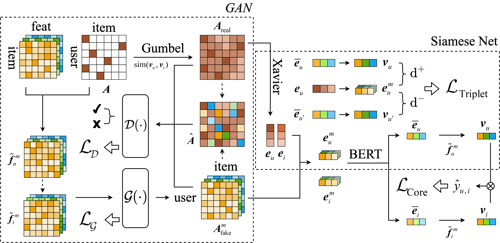

# 多模态对抗与孪生自增强推荐方法
包含两个核心组件，分别为多模态生成对抗组件和跨模态改进的孪生网络组件<br>
前者通过生成对抗的方式来扩充模态感知的交互数据，在多模态环境下进行数据增强，降低了交互数据的高度稀疏性<br>
后者利用三元组损失函数来训练跨模态改进的孪生网络，以捕捉不同用户对模态信息的特定偏好，最大化同一用户嵌入的相似关系<br>


<h2>Multi-modal Adversarial and Siamese Self-augentation Recommended method (MASSR)</h2>
总体架构图：<br>
<p align="center">

</p>


<h2>数据集参考</h2>
分别来自于“Amazon”、“Tiktok”、“Allrecipes”平台的公开历史数据集<br>
经预处理后的部分数据可参考 MASSR-data：<br>
https://pan.baidu.com/s/1AMHbYyvh4IlHnCKHir6vBg<br>
提取码: 6666


<h2>环境参考</h2>
* Python：3.9.13
* Pytorch：1.13.0+cu116
* dgl-cuda11.6：0.9.1post1


<h2>运行参考</h2>
启动实验及数据集选择示例：<br>
```
cd MASSR
python ./main.py --dataset {DATASET}
```
可选择的数据集包括：{Amazon, Tiktok, Allrecipes}<br>


<sub>@QCC 更新于 2025-3-14</sub>
